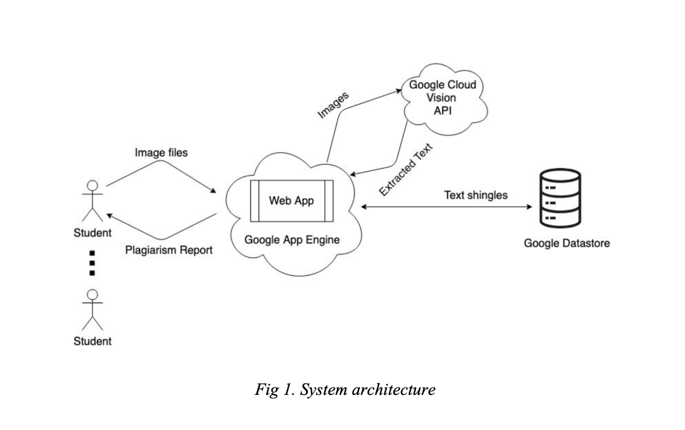
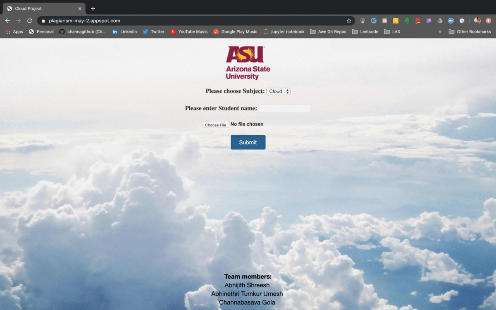

# plagiarism-check-on-image-assignment-submissions
Get text from an image using google cloud vision and return plagiarism report subject wise. Use google cloud datastore NoSQL database to store the extracted text from each submission.

